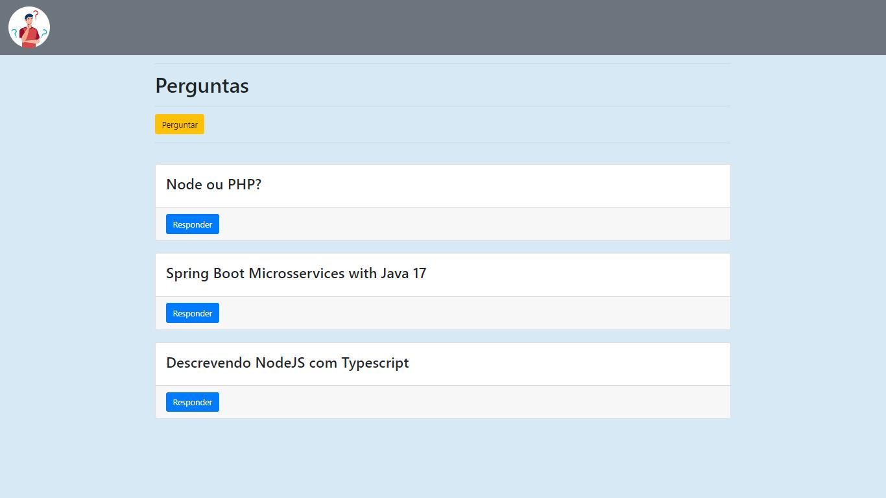

Quiz Answer - Perguntas e respostas no estilo do saudoso yahoo respostas!

Projeto criado com EJS, NodeJS, Express, Sequelize, e MySQL com Docker.

<h2>Menu Principal</h2>

 

<h2>Realizar Pergunta</h2>

 

<h2>Respostas</h2>

Para execução do projeto basta clonar o repositorio, dar npm install, e logo após npm start, acessando no navegador com localhost:3000

